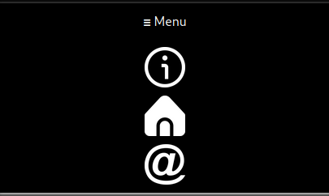

# T4.1DevDoc UX+UI+Accesibilidad+Inclusividad
---
## REQUERIMIENTOS MÍNIMOS
- [x] Documento en Figma
- [x] Implementar un navigation bar
- [x] Uso de imagenes
- [x] Uso de al menos 3 leyes de "UX"
- [x] Uso de import/export en Js
- [x] Uso de al menos una arrow function
- [x] Uso de al menos un objeto
- [x] Uso de la etiqueta "nav" en html
- [x] Crea Navigation link (home, contact, about)
---  
## Explicaion del proyecto
El proyecto consiste en una página web sencilla, en la que se te expliquen tres tipos diferentes de monstruos de la saga de videojuegos Monster Hunter. El proyecto constará de 1 pantalla principal, donde se mostrarán 3 tarjetas con una breve explicación de 3 distintos monstruos y, al hacer click, te explicará más en detalle en su respectiva página. Además esta página web aplica las siguientes leyes de UX:

- [ ] [Principo de Pareto](#principo-de-pareto)
- [ ] [Ley de la Semejanza](#ley-de-la-semejanza)
- [ ] [Ley de Fitts](#ley-de-fitts)

---
### Principo de Pareto
El principio de Pareto postula que el 80% de los efectos surgen del 20% de las causas. Esto a la programación se aplica de manera que, la característica más importante tiene que ser la más accesible.
Como es el caso de mi barra de navegación, la cual se puede acceder independientemente de en que parte de la web estés.

---
### Ley de la Semejanza
La ley de la semejanza aplica que los elementos que comparten características iguales, deben de ser tratados como un grupo en su conjunto. Así pues como se vé en la captura, estas 3 cartas de información comparten las mismas características:

- Foto indicando el monstruo
- Breve descripción física
- Marco blanco envolviendo el contenido
- Texto en blanco 

---
### Ley de Fitts
Esta ley se aplica más bien al diseño móvil. Lo que nos quiere decir es que tanto la distancia entre iconos, como el tamaño de estos; tiene que ser el indicado para evitar errores y adecuar el uso correcto de la web.

